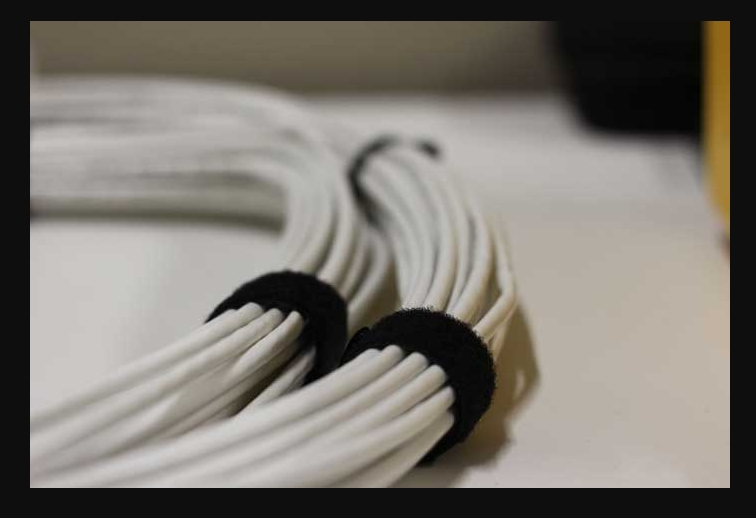
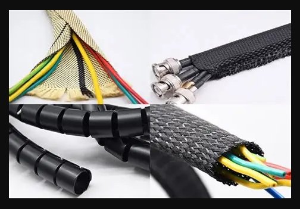
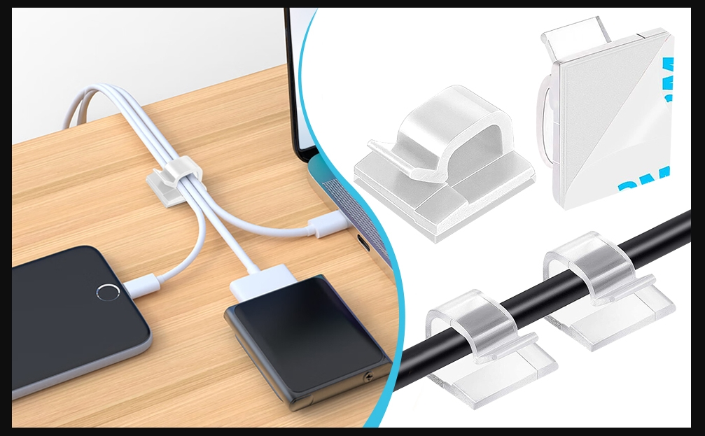

# **Cable Management Tools**

## **What Cable Management Does**

Cable management has been essential for maintaining safe, organized and efficient technical environments. Properly routed and secured cables reduce tripping hazards, prevent strain on connectors, improve airflow around equipment and make troubleshooting significantly easier. In any setting where cables are used, cable management tools and practices help maintain a clean workspace that can extend the lifespan of wiring and connected devices.
## **Types of Cable Management Tools**

### Cable Management Tools

#### Zip Ties

Zip ties are strong, inexpensive fasteners used to bundle cables together. They are ideal for permanent or semi‑permanent installations.  

**Tip:** Avoid over‑tightening, as excessive tension can pinch or crush cable insulation and stress internal conductors.

#### Velcro Straps

Velcro straps are reusable and adjustable, making them ideal for temporary setups or areas where cables are frequently changed. They provide secure bundling without applying excessive pressure that reduces the risk of cable damage.

#### Cable Sleeves

Cable sleeves protect wiring from abrasion, dust and tangling  while grouping multiple cables into a single and clean pathway. This improves both protection and appearance.

#### Cable Clips

Cable clips secure cables along walls, desks or equipment surfaces. They help maintain defined routing paths and prevent cables from sagging, snagging or becoming loose.

## Common Use Cases

- Organizing home office wiring
    
- Securing cables inside server racks
    
- Routing cables along walls or ceilings
    
- Preventing strain on connectors
    
- Improving airflow around electronic equipment
    
Good cable management improves safety, reduces clutter and makes future maintenance significantly easier.

## **How to Use Cable Management Tools**

### **1. Plan the Cable Path**

Identify where cables need to run and determine the safest and cleanest route. Avoid sharp bends, pinch points and areas with high foot traffic.

### **2. Bundle Cables Appropriately**

If needed, use **zip ties** for permanent bundles and **Velcro straps** for adjustable ones. Group cables by function (power, data, audio) to reduce interference.

### **3. Protect and Cover**

If needed, slide cables into **cable sleeves** to prevent abrasion and tangling. Sleeves also help maintain a professional appearance.

### **4. Secure the Route**

If needed, attach **cable clips** along the planned path to hold cables in place. Ensure clips are spaced evenly to prevent sagging.

### **5. Label for Future Maintenance**

Use small tags or printed labels to identify cables. This makes troubleshooting and upgrades much faster.

## **Safety Tips**

Safety is a critical part of cable management. Poorly routed cables can create tripping hazards, electrical strain or overheating issues.

### Avoid Over‑Tightening

Zip ties should be snug but not crushing. Excess pressure can damage insulation and cause shorts.

### Keep Power and Data Separate

Running power cables alongside data lines can cause interference. Maintain spacing whenever possible.

### Prevent Overheating

Avoid bundling too many cables tightly together. Especially, around high‑power equipment. Proper airflow reduces heat buildup.

### Use Non‑Conductive Tools

When working near electrical wiring, use plastic or insulated tools to avoid accidental contact with live circuits.

> Organized cables are safer cables. Proper routing prevents strain, overheating and accidental damage.
## **Internal Links**

Links to related content:

- [[multimeter-basics|Multimeter Basics]]
    
- [[measuring-tools|Measuring Tools]]