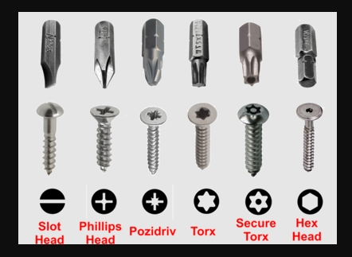
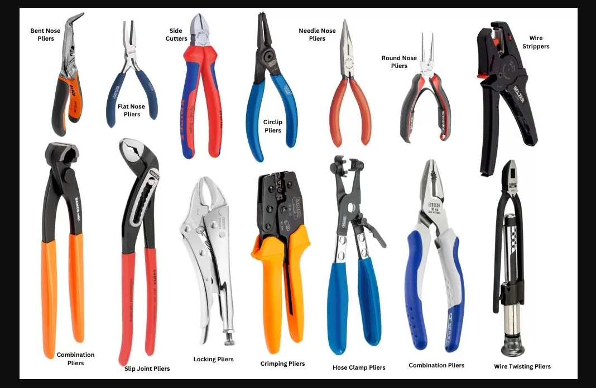
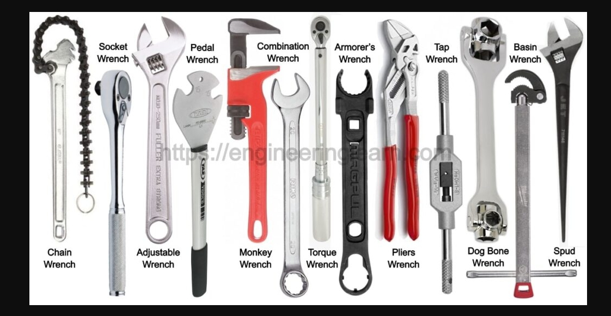

# **Hand Tools**

## **What Hand Tools Do**

Hand tools are essential for performing precise and controlled tasks. These tasks can be involved in technical, mechanical or electrical environments. Unlike power tools, hand tools rely on manual force. Hand tools give technicians greater accuracy when tightening fasteners, gripping components, cutting wires or adjusting small parts. Proper use of hand tools improves safety, prevents equipment damage and ensures reliable results during installation, repair or troubleshooting.

## **Types of Hand Tools**

### Screwdrivers

Screwdrivers are used to drive or remove screws. Common types include:

- **Phillips** for cross‑shaped screws
    
- **Flathead** for single‑slot screws
    
- **Torx** for star‑shaped screws

Choosing the correct tip prevents stripping and ensures secure fastening.

### Pliers

Pliers provide grip, leverage and cutting capability. Common types include:

- **Needle‑nose pliers** for tight spaces
    
- **Slip‑joint pliers** for adjustable gripping
    
- **Cutting pliers** for trimming wires

Pliers are essential for electrical work, cable adjustments and component handling.

### Wrenches

Wrenches apply torque to nuts and bolts. Common types include:

- **Adjustable wrenches** for variable sizes
    
- **Socket wrenches** for fast tightening
    
- **Combination wrenches** for dual‑end versatility

Using the correct wrench prevents rounding fasteners and ensures proper torque.

## **Common Use Cases**

- Tightening or loosening fasteners
    
- Cutting or stripping wires
    
- Gripping small components
    
- Adjusting brackets or mounts
    
- Opening panels or enclosures
    

> The right hand tool improves precision, reduces strain, and prevents accidental damage during technical work.

## **How to Use Hand Tools Safely**

### 1. Choose the Correct Tool

Match the tool to the task. Using the wrong size or type can damage components or cause injury.

### 2. Maintain a Secure Grip

Hold tools firmly and keep hands dry. A slipping tool can lead to stripped screws or pinched fingers.

### 3. Apply Controlled Force

Use steady and even pressure. Excessive force can break fasteners or damage equipment.

### 4. Keep Tools Clean and Organized

Wipe tools after use and store them properly. Clean tools last longer and perform more reliably.

### 5. Inspect Tools

Check for cracks, worn grips, bent tips or dull cutting edges. Replace damaged tools immediately.

## **Safety Tips**

### Avoid Using Damaged Tools

Cracked handles, bent shafts or worn tips reduce control and increase risk.

### Use Insulated Tools for Electrical Work

Insulated screwdrivers and pliers protect against accidental contact with live circuits.

### Away From Your Body

Always direct tools away from yourself to prevent injury.

### Wear Eye Protection

Small metal fragments or clipped wires can become airborne during use.

> Safe tool handling prevents injuries and ensures consistent, professional results.
## **Internal Links**

Links to related content:

- [[power-tools|Power Tools]]
    
- [[measuring-tools|Measuring Tools]]