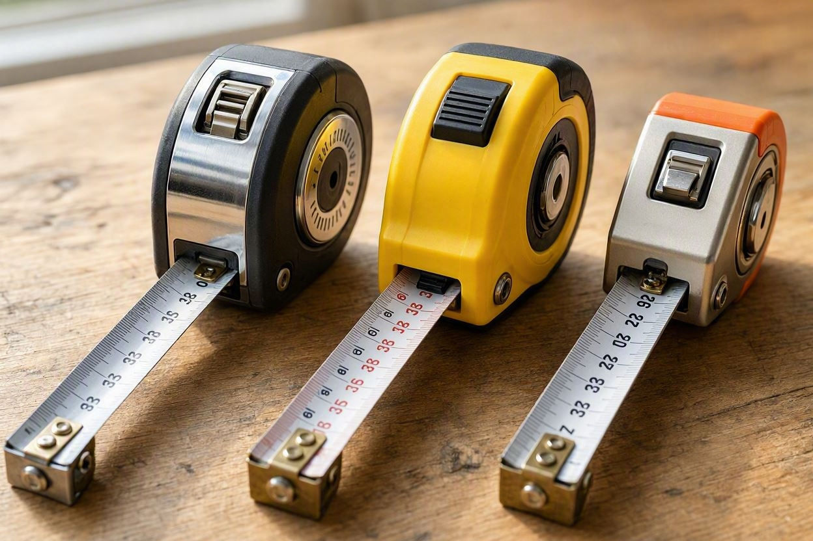
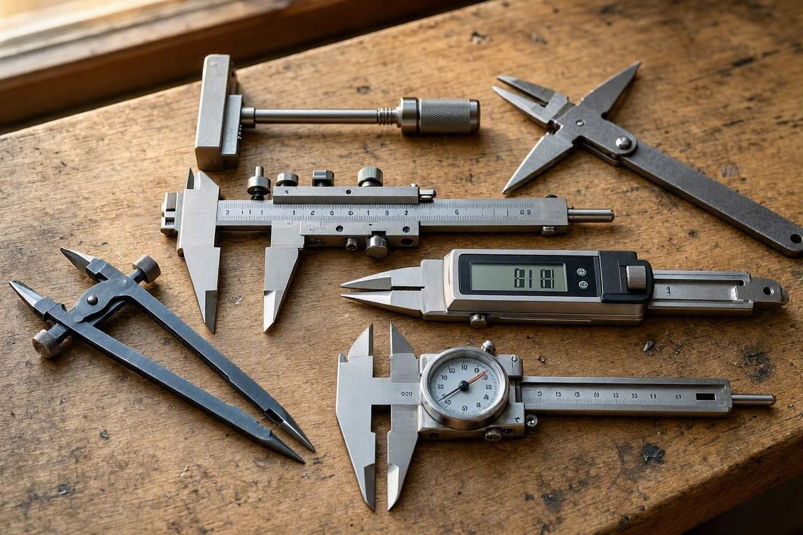
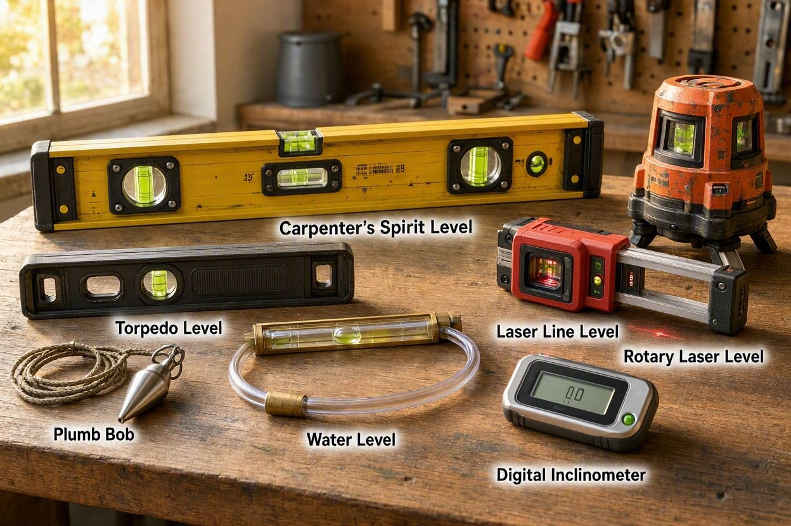

# **Measuring Tools**

## **What Measuring Tools Do**

Measuring tools provide accurate and repeatable data that technicians rely on when cutting materials, installing components, verifying distances or ensuring proper alignment. The tools are used in construction, electrical work, fabrication or general maintenance. These tools help prevent errors, reduce waste and ensure that projects meet required specifications. Precise measurements are essential for safety, performance and professional‑quality results.
## **Types of Measuring Tools**

### Tape Measures

Tape measures are flexible rulers used to measure length, width, and height. They are ideal for construction, carpentry, and general layout work. Common features include:

- Locking mechanisms
    
- Metric and imperial markings
    
- Reinforced end hooks

### Calipers

Calipers measure internal, external and depth dimensions with high precision. Common types include:

- **Digital calipers** for fast, accurate readings
    
- **Dial calipers** for mechanical precision
    
- **Vernier calipers** for fine measurement control

Calipers are essential for metalworking, machining and technical fabrication.
### Levels

Levels ensure surfaces are perfectly horizontal or vertical. Common types include:

- **Bubble levels**
    
- **Laser levels**
    
- **Digital levels**

Accurate leveling prevents misalignment and structural issues.
### Rulers & Squares

Rulers provide straight, fixed measurements. While, squares ensure perfect 90‑degree angles. Commonly used for:

- Layout marking
    
- Checking alignment
    
- Ensuring accurate cuts
## **Common Use Cases**

- Measuring distances for installation
    
- Verifying component dimensions
    
- Checking alignment and leveling
    
- Marking cut lines or drill points
    
- Ensuring accuracy in fabrication

 Accurate measurements prevent costly mistakes and ensure professional‑quality results.
## **How to Use Measuring Tools Effectively**

### 1. Choose the Right Tool

Use tape measures for long distances, calipers for precision and levels for alignment.
### 2. Read Markings Carefully

Misreading fractions or metric values can lead to incorrect cuts or misaligned installations.
### 3. Keep Tools Clean

Dust or debris on measurement surfaces can affect accuracy.
### 4. Measure Twice, Cut Once

Double‑checking measurements prevents wasted materials and rework.
### 5. Maintain Calibration

Digital tools should be checked regularly to ensure they remain accurate.
## **Safety Tips**

### Avoid Measuring Moving Parts

Always ensure machinery is powered off before measuring components.
### Use Proper Lighting

Good visibility reduces the chance of misreading measurements.
### Store Tools Properly

Bent rulers, damaged calipers or cracked levels lose accuracy.
### Keep Fingers Clear

When using calipers or retracting tape measures, avoid pinch points.

> Safe measurement practices ensure accuracy and protect both the user and the tools.
## **Internal Links**

Links to related content:

- [[hand-tools|Hand Tools]]
    
- [[power-tools|Power Tools]]

