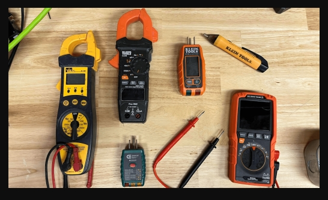
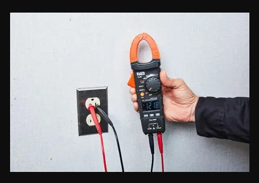
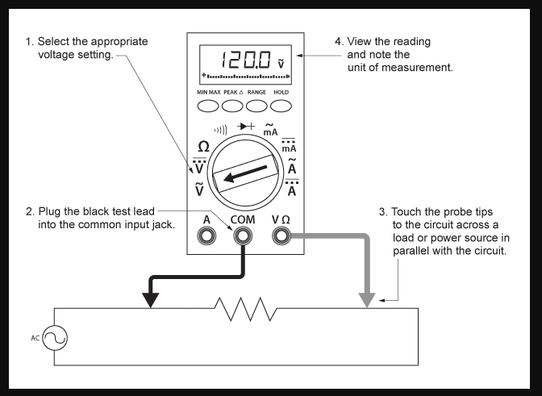

# **Multimeter Basics**

## **What a Multimeter Does**

A multimeter is an essential diagnostic tool used to measure voltage, current, resistance and continuity. These four electrical properties help technicians identify faults, verify connections and ensure safe equipment operation. The device provides real‑time data on electrical potential, current flow, opposition to current, and the presence of a complete conductive path. A multimeter supports informed troubleshooting and helps prevent hazards such as shocks, fires and equipment damage.

## **Types of Multimeters**

### Digital Multimeters (DMM)

Digital multimeters are the most common type. They display clear numeric readings on an LCD/LED screen, offer multiple measurement modes and often safety features. The safety features can include auto‑ranging, auto shut‑off and overload protection.
### Analog Multimeters

Analog multimeters use a moving needle over a calibrated scale. Although less common today, they remain useful for monitoring rapidly fluctuating signals. The needle’s motion makes trends and variations easier to observe than rapidly changing digits on a digital display.
## **Common Use Cases**

- Testing outlets and breakers
    
- Checking battery health
    
- Diagnosing faulty switches
    
- Verifying continuity in cables
    
- Measuring resistance in components

Always select the correct measurement mode before connecting the probes. Incorrect settings can damage the meter or the circuit.
## How to Use a Multimeter

### 1. Set the Correct Mode

Turn the dial to the measurement you need:

- **V** for voltage
    
- **A** for current
    
- **Ω** for resistance
    
- **🔔** for continuity

Choosing the wrong mode can lead to inaccurate readings or equipment damage.
### 2. Insert the Probes

- Black probe → **COM** port
    
- Red probe → **V/Ω/mA** port (depending on measurement)
### 3. Test the Component or Circuit

- **Voltage:** Place probes across the two points you want to measure.
    
- **Resistance:** Touch probes to both ends of the component (ensure power is OFF).
    
- **Continuity:** Touch probes to both ends of a wire or connection, and a beep indicates a complete path.
### 4. Read the Display

Digital multimeters show a numeric value. If the reading jumps or shows “OL,” the range may be incorrect or the circuit may be open.
### 5. Power Off and Store Safely

Turn off the meter and wrap the probes neatly to prevent damage.
## **Safety Tips**

Safety is the most important part of working with a multimeter. Because the tool interacts directly with electrical circuits, improper use can lead to damaged equipment, blown fuses or personal injury. Following basic precautions ensures accurate readings and keeps both you and your tools protected.
### Check the Meter Before Use

Inspect the casing, display and rotary dial for cracks or damage. Examine the test leads and probes for frayed insulation, exposed conductors or loose connectors. Do not use a damaged meter or damaged probes. If founded, replace them immediately.
### Verify the Settings

Always double‑check the dial before touching the probes to a circuit.

- Use DC voltage (V⎓ or V–) for batteries and most electronics.
    
- Use AC voltage (V~) for outlets and household wiring.
    
- Never attempt to measure current unless you understand the correct procedure and are using the proper current input. Incorrect current measurements are a common cause of blown fuses and meter damage.
### Use the Correct Ports

- The black probe always goes into the **COM** (common) port.
    
- The red probe should be in the **V/Ω** (voltage/resistance) port for most measurements.
    
- Only move the red probe to a dedicated **A** (amps) port when measuring current, and return it to V/Ω immediately afterward. Using the wrong port for voltage measurements can blow the meter’s internal fuse or damage the instrument.
### Avoid Live Resistance Testing

Never measure resistance on a powered circuit. Turn the power off, and (if applicable) discharge capacitors before taking resistance readings. Measuring resistance on a live circuit can damage both the meter and the component under test, and may create a shock hazard.
### Stay Aware of Your Environment

Work on dry and non‑conductive surfaces. Avoid wet areas, metal benches or cramped spaces where accidental contact with live parts are more likely to occur. When testing higher‑voltage circuits, use the “one‑hand rule” (keep one hand behind your back or in your pocket) to reduce the chance of current passing across your chest. Keep your fingers behind the probe guards and avoid touching exposed metal tips.

> A multimeter is safe when used correctly, but a wrong setting, incorrect probe placement or careless technique can turn a simple test into a dangerous mistake.
## **Internal Links**

Links to related content:

- [[3-tools-and-resources/cable-management-tools|Cable Management Tools]]
    
- [[3-tools-and-resources/measuring-tools | Measuring Tools]]