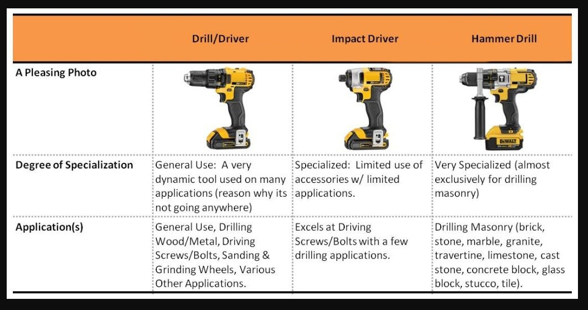
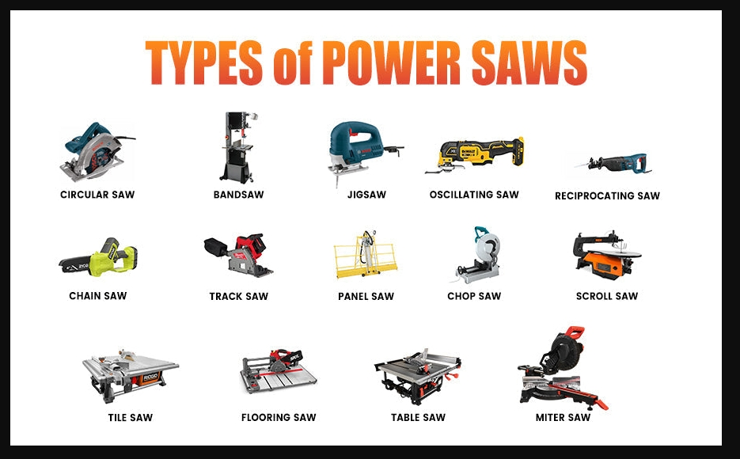

# **Power Tools**

## **What Power Tools Do**

Power tools provide speed, efficiency and force that manual tools cannot match. They are essential for drilling, cutting, fastening, grinding and shaping materials. The are used in construction, maintenance, electrical work, general technical environments and at home. By using electric or battery‑powered motors, power tools reduce physical strain and increase precision. These tools can allow technicians to complete tasks quickly and safely.
## **Types of Power Tools**

### Drills

Drills are used to bore holes, drive screws and fasten hardware. Common types include:

- **Cordless drills** for mobility
    
- **Hammer drills** for masonry
    
- **Impact drivers** for high‑torque fastening

Choosing the correct drill bit ensures clean cuts and prevents damage to materials.
### Saws

Power saws cut wood, metal, plastic and other materials. Common types include:

- **Circular saws** for straight cuts
    
- **Jigsaws** for curved or detailed cuts
    
- **Reciprocating saws** for demolition and rough cutting

Using the right blade improves accuracy and reduces kickback.
### Grinders

Grinders shape, smooth or remove material. Common types include:

- **Angle grinders** for metalwork
    
- **Bench grinders** for sharpening tools
    
- **Die grinders** for precision shaping

Proper grinding technique prevents overheating and ensures clean results.
## **Common Use Cases**

- Drilling holes in wood, metal, or plastic
    
- Cutting materials for installation
    
- Fastening screws and bolts
    
- Shaping or smoothing surfaces
    
- Removing rust, burrs, or excess material

 Power tools increase efficiency and accuracy that can make complex tasks faster and safer to complete.
## **How to Use Power Tools Safely**

### 1. Choose the Right Tool

Match the tool to the material and task. Using the wrong tool can cause damage or injury.
### 2. Inspect Before Use

Check for frayed cords, loose parts, dull blades or cracked housings. Replace damaged components immediately.
### 3. Secure the Workpiece

Clamp or stabilize materials before cutting or drilling to prevent slipping.
### 4. Use Proper PPE

Wear eye protection, gloves and hearing protection. Power tools generate debris, noise and vibration.
### 5. Maintain Control

Hold tools firmly with both hands when required. Keep fingers away from moving parts and cutting edges.
### 6. Disconnect Power Before Changing Accessories

Unplug or remove the battery before swapping blades, bits or attachments.
## **Safety Tips**

### Avoid Loose Clothing

Loose sleeves or jewelry can get caught in moving parts.
### Keep Blades and Bits Sharp

Sharp tools cut cleaner and require less force which reduces risk.
### Let the Tool Do the Work

Avoid forcing the tool. Excess pressure can cause binding or kickback.
### Maintain a Clean Workspace

Clutter increases tripping hazards and reduces visibility.

> Safe operation ensures power tools remain reliable, effective and long‑lasting.
## **Internal Links**

Links to related content:

- [[hand-tools|Hand Tools]]
    
- [[measuring-tools|Measuring Tools]]

